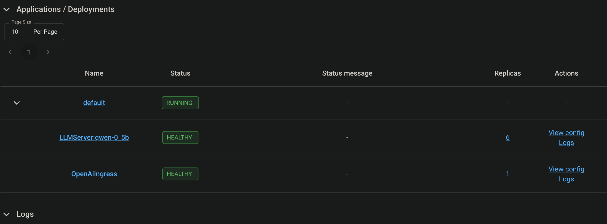
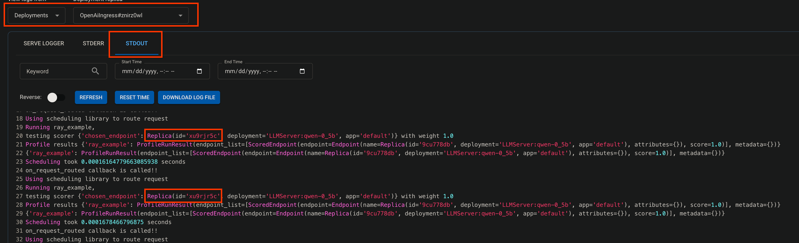

# py-inference-scheduler
A Python implementation of an inference request scheduler, drawing inspiration from the k8s Inference Gateway project.


## How to use
This example uses a simple implementation of prefix cache aware routing. This example uses Ray Serve's custom routing: https://docs.ray.io/en/latest/serve/advanced-guides/custom-request-router.html. 

### Prereqs
- Have a k8s clusters with gpu accelerators (the example uses H100s, which is admittedly overkill for this specific example, use the accelerators that best fit your scenario)
- Ensure your k8s cluster has kuberay installed
- This repo cloned
- A CLI that has ray installed (a venv was used in development)

### Steps

1. CD into this repo `cd ./some-path/py-inference-scheduler`
1. Create the scheduler configuration: `kubectl apply -f ./configs/scheduler-configmap.yaml`
1. Create the Ray Cluster vis RayService CRD `kubectl apply -f ./configs/ray_service.yaml`. Wait for the resources to reach `Ready`
1. Run `kubectl get svc`, copy the `ray-serve-llm-XXXXX-head-svc` service name.
1. Create a new CLI window and run `kubectl port-forward ray-serve-llm-XXXXX-head-svc 8265:8265`. This is the dashboard port, which allow our Ray CLI to communicate with this ray cluster. You can now see the dashboard at http://localhost:8265.
1. Run `ray job submit   --address="http://127.0.0.1:8265"   --working-dir="./" -- python ./ray_igw_router.py`. Which deploys our llm with our custom logic. Refer to the python file for more details.
1. Go to the Serve tab of the dashboard, (it may take a few minutes for the deployment to stabilize) eventually should look something like: 

1. We need another CLI window to port forward to the service port: `kubectl port-forward svc/ray-serve-llm-XXXXX-head-svc 8000`

1. Curl your deployment multiple times to prove that the routing is irritatingly sticky! Example curl command:
```
curl \
  --location 'http://localhost:8000/v1/chat/completions' \
  --header 'Content-Type: application/json' \
  --data '{
      "model": "qwen-0.5b",
      "messages": [
          {
              "role": "system", 
              "content": "You are a helpful assistant."
          },
          {
              "role": "user", 
              "content": "Provide steps to serve an LLM using Ray Serve."
          }
      ]
  }'
```

1. To prove that all requests sharing prefixes route to the same replica, we will take a look at the OpenAiIngress logs. Ensure that you use the same configuration shown here (notw that the replicas should be the same for this example): 




## Next steps
This is a rough in example. But creates the connection to make a _python native_ router that works in python native environs, such as Ray. This connection is important because it allows us to bring the learnings of the [Inference Gateway](https://github.com/kubernetes-sigs/gateway-api-inference-extension) project to non-k8s environments. Allowing the communities to centralize efforts and create mutually beneficial optimizations. To improve this effort we will:

- Make integration with the vLLM replica data simpler. 
   - Reading the Ray implementation of [Prefix Aware Routing](https://docs.ray.io/en/latest/serve/llm/user-guides/prefix-aware-routing.html) made it difficult to discern how data is shared in the Ray environemnt. We will work on this UX and allow these to be more flexible.

- Implement the most valuable IGW plugins here (like running requests + prefix cache, etc).
  - Long-term work will be to explore how keeping the two efforts in sync in an automated way

- Benchmark to prove the value remains.
- Scale test this effort to prove that it works in high-volume situations, (such as RL sampling)
- Make this experiment-ready, so this tool is reliable, and gives optimal inference/sampling performance out of the box.

- Optimisticially, work with the Ray team to integrate the custom routing to be more friendly to our proven and [adopted](https://github.com/llm-d/llm-d-inference-scheduler) framework for inference scheduling.